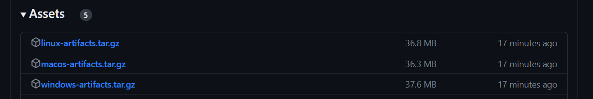

# rebis-grade-excel-importer

This tool import Microsoft Teams, Google Classroom Grade Outputs to REBIS Excel file for Automated Grading Import

## Download

Download and export artifacts and run `rebis-grade-excel-importer.exe` from command-line as shown below

[Releases · ucoruh/rebis-grade-excel-importer · GitHub](https://github.com/ucoruh/rebis-grade-excel-importer/releases)



## Usage

Example batch script to run  for windows

```batch
@echo off
rem source excel file you can get from TEAMS or GOOGLE CLASSROOM
set /p first_file="source.xlsx"
rem target excel file this will be uploaded to REBIS
set /p second_file="ExcelNotGirisTaslak4-30-2023.xls"
rem reference column e-mails are unique, this is column header
set /p reference_column="E-Posta"
rem source grade value taken from source excel column header
set /p source_column="Not"
rem target grade value column header name
set /p destination_column="Not"
rem source excel sheet number (start from 0)
set /p source_sheet=1
rem target excel sheet number (start from 0)
set /p destination_sheet=0
rebis-grade-excel-importer.exe %first_file% %second_file% %reference_column% %source_column% %destination_column% %source_sheet% %destination_sheet%
pause
```

## Supported OS

- Windows

- Linux

- MacOS

## Development Environmet

- .NET Core 6.0 + Csharp

- Visual Studio 2022 Community Edition
