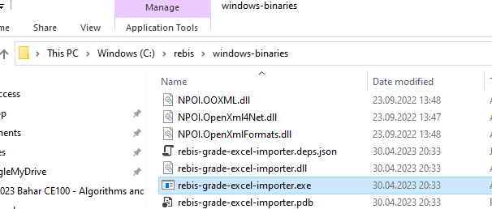
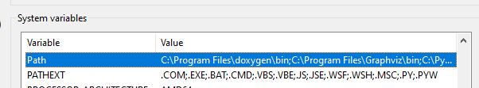
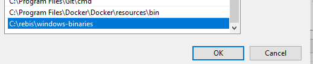

# Rebis-Grade-Excel-Importer

Rebis-Grade-Excel-Importer is a tool designed to automate the grading import process in REBIS by importing Microsoft Teams and Google Classroom grade outputs to REBIS Excel files. The following guide will help you understand how to use the tool and make the necessary configurations.

## Download

You can download Rebis-Grade-Excel-Importer from the [Releases page on GitHub](https://github.com/ucoruh/rebis-grade-excel-importer/releases). Simply export the artifacts and run the `rebis-grade-excel-importer.exe` file from the command-line as shown below.

## Installation

1. Extract the folder and move it to `C:/rebis/windows-binaries`.



2. Add this folder to your system's `path` variables.
   - You can follow the steps given below to add it to your system's path variables.
     - Open the Control Panel and click on "System".
     - Click on "Advanced system settings" and then click on "Environment Variables".
     - Under "System variables", scroll down to "Path" and click on "Edit".
     - Add the folder location `C:/rebis/windows-binaries` to the end of the variable value, separated by a semicolon. Click "OK" to save.





## Usage

1. Create a batch file named `run.bat` in the same location as your Excel files.
2. Copy the example batch script given below and paste it into your `run.bat` file.
3. Replace the file names with the names of your source and destination Excel files.
4. Check that the sheet indices are correct. Note that sheet indices start from 0.
5. Save the file and run it.

batchCopy code

```bash
@echo off 
rem Source Excel file you can get from Teams or Google Classroom. 
set first_file="classroom-excel.xlsx" 
rem Target Excel file. This will be uploaded to REBIS. 
set second_file="rebis-excel.xls" 
rem Reference column e-mails are unique. This is the column header. 
set reference_column="E-Posta" 
rem Source grade value taken from the source Excel column header. 
set source_column="Not" 
rem Target grade value column header name. 
set destination_column="Not" 
rem Source Excel sheet number (start from 0). 
set source_sheet=1 
rem Target Excel sheet number (start from 0). 
set destination_sheet=0 
rebis-grade-excel-importer.exe %first_file% %second_file% %reference_column% %source_column% %destination_column% %source_sheet% %destination_sheet% 
pause
```

## Update

Create a update.bat file near application and copy following code and save

```bash
@echo off
setlocal EnableExtensions EnableDelayedExpansion

echo Setting current working directory...
CD /D "%~dp0"

set /p answer=This script will delete all .exe, .dll, .json, and .pdb files in the current directory. Do you want to continue (Y/N)?

if /i "!answer!" NEQ "Y" (
    echo Script cancelled.
    pause
    exit /b
)

echo Deleting current files...
for %%f in (*.exe *.dll *.json *.pdb) do (
  echo Deleting "%%~nxf"
  del "%%f"
)

echo Downloading and installing jq...
curl -sL -o jq.exe https://github.com/stedolan/jq/releases/download/jq-1.6/jq-win64.exe

echo Extracting download URL that ends with "windows-binaries.tar.gz" from JSON response using jq...
for /f "delims=" %%a in ('curl -s https://api.github.com/repos/ucoruh/rebis-grade-excel-importer/releases/latest ^| jq -r ".assets[] | select(.name | endswith(\"windows-binaries.tar.gz\")) | .browser_download_url"') do (
    set "download_url=%%a"
)

echo Downloading Windows binaries...
curl -sL -o windows-binaries.tar.gz "%download_url%"

echo Extracting contents to current directory...
tar -xf "windows-binaries.tar.gz" 

echo Cleaning up...
del "windows-binaries.tar.gz"
del "jq.exe"

echo REBIS Grade Excel Importer downloaded successfully!
echo Download URL: %download_url%
echo Done.
pause


```

## Supported OS

Rebis-Grade-Excel-Importer is supported on Windows, Linux, and MacOS.

## Development Environment

Rebis-Grade-Excel-Importer is developed using .NET Core 6.0 and C#. Visual Studio 2022 Community Edition is used as the development environment.

## License

This project is licensed under the MIT License - see the [LICENSE](LICENCE.md) file for details.

## Contributors

We welcome contributions from everyone. Here are the people who have contributed to this project:

- [Asst. Prof. Dr. Uğur CORUH](https://github.com/ucoruh)

Thank you for your help!
